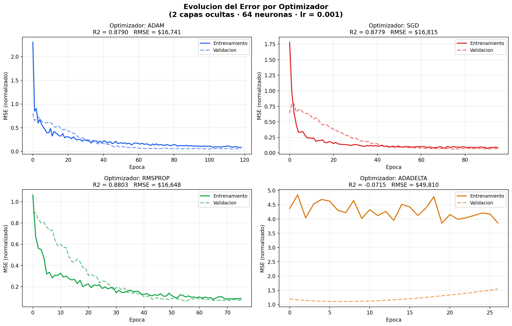
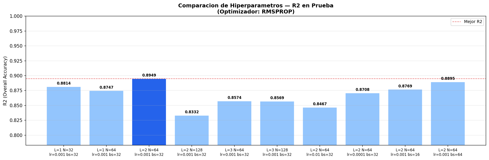
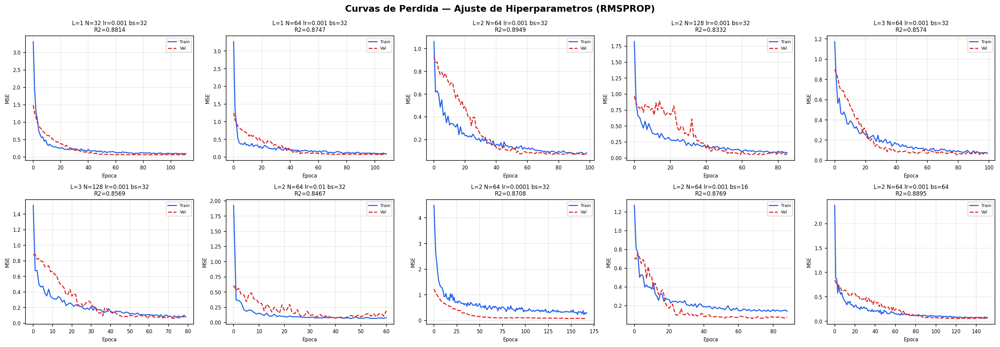
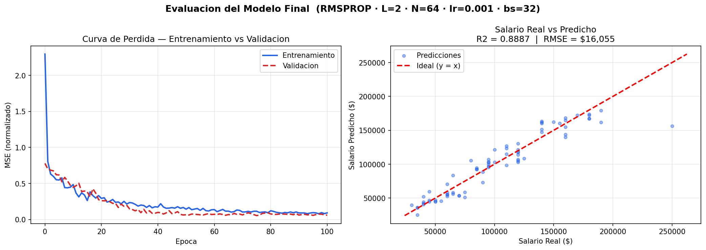
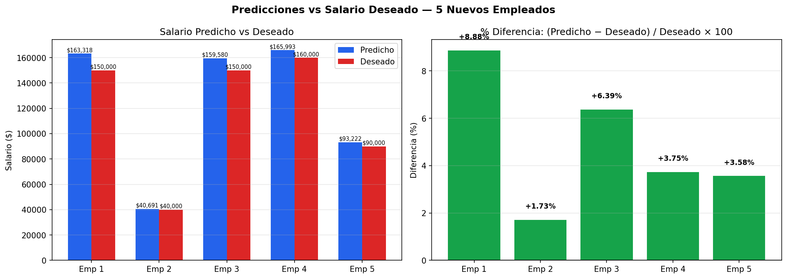

# tarea2_SSPIA2

## Descripción del Proyecto
Este proyecto utiliza un conjunto de datos de salarios para entrenar y evaluar modelos de aprendizaje automático. Se implementaron técnicas de preprocesamiento, ajuste de hiperparámetros y evaluación de modelos para predecir salarios basados en características como género, nivel educativo, título del trabajo, edad y años de experiencia.

## Archivos Generados
A continuación, se describen los archivos generados durante el análisis:

- **fig_optimizadores.png**: Comparación de la evolución del error para diferentes optimizadores.
- **fig_hiperparametros.png**: Comparación de configuraciones de hiperparámetros y su impacto en el R2.
- **fig_curvas_hp.png**: Curvas de pérdida para las configuraciones de hiperparámetros evaluadas.
- **fig_evaluacion_final.png**: Evaluación del modelo final, incluyendo curva de pérdida y comparación de predicciones vs valores reales.
- **fig_predicciones_nuevos.png**: Comparación de predicciones y salarios deseados para nuevos empleados.

## Capturas Generadas
A continuación, se adjuntan las capturas generadas durante el análisis:

### Comparación de Optimizadores

### Comparación de Hiperparámetros

### Curvas de Pérdida por Hiperparámetros

### Evaluación del Modelo Final

### Predicciones para Nuevos Empleados

## Datos
- **salarios.csv**: Conjunto de datos original utilizado para el análisis.
- **prediccion.xlsx**: Datos de nuevos empleados para predicción.
- **predicciones_nuevos.csv**: Resultados de las predicciones para nuevos empleados.
- **tabla_hiperparametros.csv**: Tabla resumen de las configuraciones de hiperparámetros evaluadas.

## Conclusión
El proyecto demuestra el uso de técnicas avanzadas de aprendizaje automático para predecir salarios y evaluar modelos. Los resultados muestran la importancia de ajustar hiperparámetros y seleccionar el optimizador adecuado para mejorar el rendimiento del modelo.